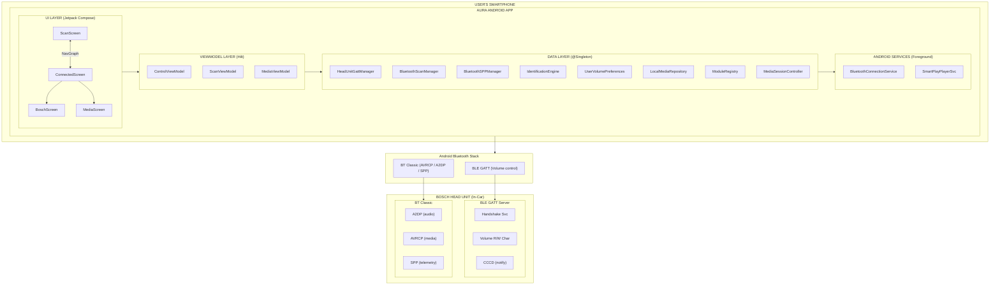

## Getting started
* Fork this repository (Click the Fork button in the top right of this page, click your Profile Image)
* Clone your fork down to your local machine

```markdown
git clone https://github.com/your-username/hacktoberfest.git
```

* Create a branch

```markdown
git checkout -b branch-name
```

* Make your changes 
* Commit and push

```markdown
git add .
git commit -m 'Commit message'
git push origin branch-name
```

* Create a new pull request from your forked repository (Click the `New Pull Request` button located at the top of your repo)
* Wait for your PR review and merge approval!
* __Star this repository__ if you had fun!


## Happy new year message.

Hey! new year eve are comming, be prepared to the "FEAST"
Having fun is the first way you think but don't forget to make a wish.

`So let's share our wish.`

## Getting started
* Fork this repository (Click the Fork button in the top right of this page, click your Profile Image)
* Clone your fork down to your local machine

```markdown
git clone (copy the repo link here)
```

* Create a branch

```markdown
git checkout -b branch-name
```

* Make your changes (choose from any task below)
* Commit and push

```markdown
git add .
git commit -m 'Commit message'
git push origin branch-name
```

* Create a new pull request from your forked repository (Click the `New Pull Request` button located at the top of your repo)
* Wait for your PR review and merge approval!
* __Star this repository__ if you had fun!


## Want to wish ? :tada:

Go to USER.json, follow the structure, and that's it.
___
- Your name ```"name":"julkwel"```

- Your image link, (like fb profile, ... , preference github image link) ```"image":"image_link"```

- Your wishes ```"message":"your_message"```

- Github url ```"username":"github_username"```

- Flag : see [this link](http://flag-icon-css.lip.is/?continent=Africa) , eg: `mg` for Madagascar

___

## FEATURE

1. Translation


*Code for fun :blush:* 
